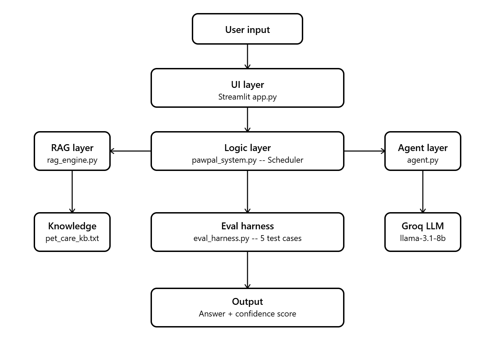

# PawPal+ Applied AI System

## Base Project
This project extends **PawPal+**, originally built in Module 2. The original system was a Streamlit app that helped pet owners manage daily care tasks using Python OOP, a scheduling algorithm, and conflict detection. It included Owner, Pet, Task, and Scheduler classes with sorting, filtering, and recurring task logic.

## What's New
- **RAG (Retrieval-Augmented Generation)** -- the AI looks up a pet care knowledge base before answering questions
- **Agentic Workflow** -- an AI agent analyzes your schedule step by step and suggests improvements
- **Confidence Scoring** -- every AI answer includes a confidence score
- **Eval Harness** -- automated script that tests the AI on 5 predefined questions and prints pass/fail results
- **Guardrails** -- input validation and error handling throughout

## System Architecture
1. **UI Layer** -- Streamlit frontend in `app.py`
2. **Logic Layer** -- `pawpal_system.py` handles scheduling, sorting, and conflict detection
3. **RAG Layer** -- `rag_engine.py` retrieves relevant chunks from `pet_care_kb.txt` and sends them to the Groq LLM
4. **Agent Layer** -- `agent.py` runs a multi-step analysis of the schedule and returns observable reasoning steps

Data flows like this: User input -> Scheduler -> RAG Engine -> Groq LLM -> Response + Confidence Score -> UI



## Setup Instructions

1. Clone the repo:
```bash
git clone https://github.com/NewDawn-zero/applied-ai-system-project.git
cd applied-ai-system-project
```

2. Install dependencies:
```bash
pip install -r requirements.txt
```

3. Create a `.env` file in the project root:
```
GROQ_API_KEY=groq-api-key
```

4. Run the app:
```bash
streamlit run app.py
```

5. Run the eval harness:
```bash
python eval_harness.py
```

6. Run tests:
```bash
python -m pytest
```

## Sample Interactions

**Example 1 -- RAG Question:**
- Input: "How often should I feed my dog?"
- Output: "Feed your dog 2 times per day, morning and evening. Keep feeding times consistent as pets thrive on routine."
- Confidence Score: 0.38

**Example 2 -- Agent Analysis:**
- Input: Schedule with Morning Feed at 07:00 and Walk at 08:00
- Output: Step by step analysis identifying missing grooming and medication tasks and a 3/5 star quality rating

**Example 3 -- Conflict Detection:**
- Input: Two tasks scheduled at 12:00
- Output: Warning message flagging the conflict in the UI

## Design Decisions
- Used Groq with llama-3.1-8b-instant for free, fast inference
- RAG uses keyword scoring to retrieve the top 2 most relevant chunks before calling the LLM
- Confidence scoring measures word overlap between the answer and retrieved chunks
- Agent workflow shows observable intermediate steps so the reasoning is transparent

## Testing Summary
5/5 eval harness tests passed. Average confidence score was 0.28. 
The AI performed best on vet and exercise questions. It struggled 
slightly on grooming and food safety questions where the knowledge 
base chunks did not match closely enough.

## Loom Walkthrough
[Loom link here]

## System Design

**Initial Design**

Owner -- holds the owner's name and their list of pets
Pet -- holds pet info and a list of tasks
Task -- represents one care activity with a time, duration, and priority
Scheduler -- sorts, filters, and manages all tasks across pets

**Design Changes**

No major changes, the initial design matched the final implementation.

## Scheduling Logic and Tradeoffs

**Constraints and Priorities**

The scheduler considers time of day and priority level. Time was the most important constraint because tasks like medication and feeding are time-sensitive and need to happen in the right order.

**Tradeoffs**

Conflict detection only checks for exact time matches, not overlapping durations. Two tasks at 08:00 and 08:10 with 30 minute durations would not be flagged even though they overlap.

## Testing and Verification

**What Was Tested**

Tested task completion, chronological sorting, recurring task scheduling, and conflict detection -- the core behaviors of the scheduler.

**Confidence**

4/5. Edge cases like empty pet lists or two pets with identical task names could use more coverage.

## Reflection

**What Went Well**

The UML design phase made implementation straightforward. Having a clear blueprint before coding saved a lot of time.

**What I Would Improve**

Add the ability to mark tasks complete directly in the Streamlit UI.

**Key Takeaway**

Designing the system before writing code made the whole build process much smoother and I always knew exactly what the next step was.